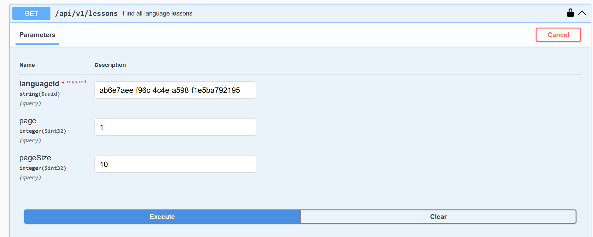
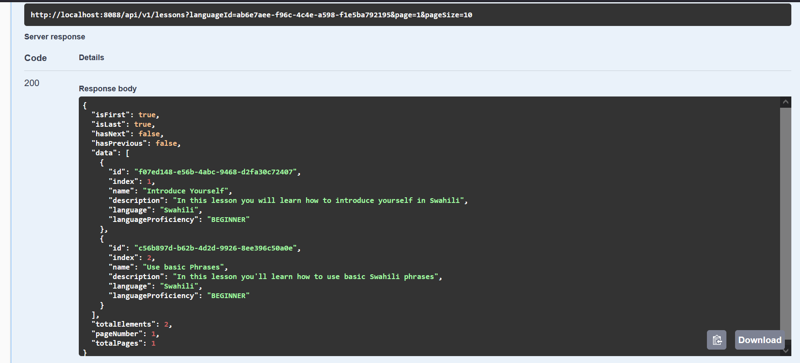
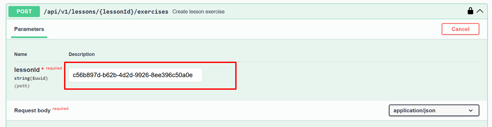

# \[ 🚧 Work in progress 👷‍♀️⛏👷🔧️🚧 \] Zeraki MidLevel Backend Developer Assessment

## Objectives
* API Development: Develop RESTful services to manage lessons, exercises, and user progress.
* Database Design: Design and implement a database schema suitable for the requirements.
* Business Logic: Implement business logic to track and update user progress and manage lesson workflows.
* Authentication: Implement basic authentication to manage access to user-specific data.
* Testing: Write unit tests and integration tests for the API.


## Prerequisites
[Java 17+](https://openjdk.org/projects/jdk/17/)

[Apache Maven 3.9.4+ ](https://maven.apache.org/download.cgi)

[Docker desktop](https://www.docker.com/get-started/)

## Running Locally

Run tests `mvn clean test`

Build docker image `mvn clean install -DskipTests`

cd docker `docker-compose up`

## API Documentation
The API documentation is done using [Swagger](https://swagger.io/specification/).
The system also supports [Redoc](http://localhost:8088/redoc) for API documentation


## Application Overview

The system contains 2 main actors: 
* Tutor
* Learner

The tutor manages supported languages, lessons and exercises. The Learner on the other hand manages their own account and can start a language lesson. 

## Understanding the system entities


The system has 9 entities namely:
* User - Stores user information.
* PasswordReset - Stores password reset information
* SupportedLanguage - Stores a list of languages that users can learn. A supported language can have 1 or more lessons.
* Lesson - Stores a language lesson. Lessons can have 1 or more exercises.
* Exercises - Stores the learning tasks to be performed by the learner. This system supports 4 types of exercises:
    * Multiple choice - single answer
    * Multiple choice - Multiple answers
    * Short written answers
    * Matching exercises where learners match a pair of words in different languages
* MultipleChoice - Stores multiple choices for exercises with multiple choices.
* ExerciseAnswer - Stores the exercise answer.
* AnswerAttempt - Stores all responses from the learner.
* UserProgress - Stores learners progress

## Using the system

Once the system is up and running, navigate to [Swagger UI](http://localhost:8088/swagger-ui/index.html#/)

From the swagger UI its clear that the system has 4 main collections
  * Authentication
  * Users
  * Languages
  * Lessons

### Authentication


The Authentication collection provides endpoints for: 
  * User Registration (Unsecured)
  * Password reset (Unsecured)
  * Login (Unsecured)
  * Update password (Secured)
  * Get Jwt refresh token (Secured)

### Users


The users collection provides an endpoints for: 
  * users to update their details
  * learners to check their learning progress
  * tutors to view all users in the system
  * tutors to find a user's details by id
  * tutors to check the learning progress of a learner

### Languages


The languages collection provides endpoints for:
  * Add supported languages
  * Update supported language
  * Delete supported language
  * Find a supported language by Id
  * Find all supported languages
  * Start learning a new language

### Lessons


The lessons collection is by far the largest collection with endpoints for:
  * Create a language lesson
  * Find all lessons 
  * Find lesson by Id
  * Update lesson
  * Delete lesson
  * Create a lesson exercise
  * Find all lesson exercises
  * Find lesson exercise by Id
  * Update lesson exercise
  * Delete lesson exercise
  * Get next exercise for a lesson
  * Submit an answer to an exercise
  * Get next lesson recommendation

## Authenticating Requests
Steps to authenticate on swagger ui and access secured endpoints:

### Step 1
  Ensure that you have registered as a user from the register endpoint by providing your name, email & password.


### Step 2
  On successful account creation use your registered email and password to login from the login endpoint.

  On successful login you will get a response similar to the one shown below:


### Step 3
  Copy the token from the response above and scroll to the top of the swagger ui page and click the authorize button.

Paste the token into the popup dialog and click authorize then close the popup window.

With that all you request initiated from the swagger ui will be authenticated.

## Managing Languages, Lessons and Exercises 

To manage lessons and exercises, the user needs to have the TUTOR role. The system has two users with this role:
```
email: admin@llm.com
password: p@55w0Rd
---------------------------------------
email: jbloch@java.com
password: p@55w0Rd
```
Use any of the above credentials to login and authenticate requests.

### Creating a new lesson

#### Step 1
To create a new lesson, ensure that the language for which the lesson belongs to exists. This can be done by making a get request to the API endpoint responsible for getting all supported languages.


If the language does not exist then you can create the new language by specifying the language name and making the POST request.


#### Step 2
Copy the id of the language you are creating a lesson for. I will use Swahili for demonstration purpose but feel free to use any language of choice. Using this ID we can create a payload for creating a new lesson.

```json
{
  "languageId": "ab6e7aee-f96c-4c4e-a598-f1e5ba792195",
  "languageProficiency": "BEGINNER",
  "index": 2,
  "percentagePassMark": 90,
  "name": "Use basic Phrases",
  "description": "In this lesson you'll learn how to use basic Swahili phrases"
}
```

Paste the language ID into the `languageId` field of the payload.
The system supports 3 types of language proficiency levels `BEGINNER` , `INTERMEDIATE` , and `ADVANCED`.

The index field specifies the order in which one can take the lessons. For instance, if a learner selects their proficiency level as a beginner, they will have to start the lesson with index 1 followed by 2 and so on and so forth.

The `percentagePassMark` field specifies the minimum percentage score a learner must achieve to be considered a pass for that lesson.
#### Step 3
Make the POST request to the Create Language Lesson endpoint with the above payload.


🎉🎉🎉🎉🎉🎉🎉

### Creating a Lesson Exercise

#### Step 1

To create an exercise, get the Id of the lesson for which an exercise is being created for. This can be done by making a GET request to the 
find all language lessons endpoint:




#### Step 2
Use the lesson ID as a path variable for the create lesson exercise endpoint.



#### Step 3

The following json snippets shows how to structure the payload for creating an exercise depending on the task type of exercise.

```json
{
  "index": 1,
  "task": "Translate: Iam a man",
  "taskScore": 2,
  "taskType": "MULTIPLE_CHOICE_SINGLE_ANSWER",
  "multipleChoices": [
    {
      "index": 1,
      "choice": "Mimi ni mwanamke"
    },
    {
      "index": 2,
      "choice": "Mimi ni mwanake"
    },
    {
      "index": 3,
      "choice": "Mimi ni mwanamme"
    }
  ],
  "answer": {
    "multipleChoices": [
      3
    ]
  }
}
```

```json
{
  "index": 2,
  "task": "Match the following words",
  "taskScore": 5,
  "taskType": "MATCHING",
  "matchingChoices": [
    {
      "index": 1,
      "choice": "Cat"
    },
    {
      "index": 2,
      "choice": "Plate"
    },
    {
      "index": 3,
      "choice": "Cup"
    },
    {
      "index": 4,
      "choice": "Goat"
    },
    {
      "index": 5,
      "choice": "Table"
    },
    {
      "index": 6,
      "choice": "Kikombe"
    },
    {
      "index": 7,
      "choice": "Mbuzi"
    },
    {
      "index": 8,
      "choice": "Paka"
    },
    {
      "index": 9,
      "choice": "Meza"
    },
    {
      "index": 10,
      "choice": "Sahani"
    }
  ],
  "answer": {
    "matchingPairs": [
      [
        "Goat", "Mbuzi"
      ],
      [
        "Table", "Meza"
      ],
      [
        "Plate", "Sahani"
      ],
      [
        "Cat", "Paka"
      ],
      [
        "Cup", "Kikombe"
      ]
    ]
  }
}
```

```json
{
  "index": 3,
  "task": "Write this in english: Kalamu",
  "taskScore": 3,
  "taskType": "SHORT_ANSWER",
  "answer": {
    "answerText": "Pen"
  }
}
```

## Learning a New Language

To learn a new language, the user needs to have the LEANER role which is the default role for anyone who registers to use the system.

